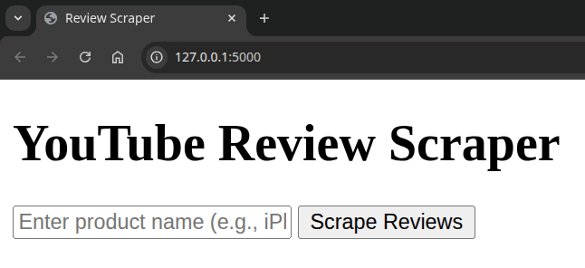
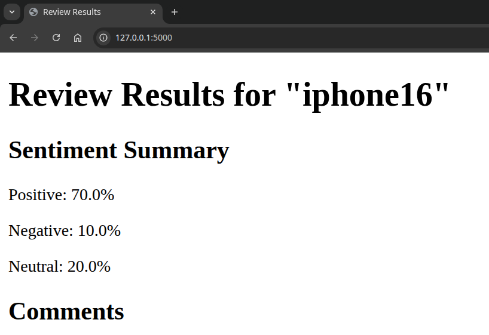
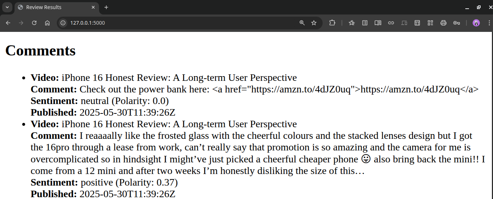

# YouTube Review Scraper MVP

## Overview
A tool to scrape YouTube comments for a product, process Hinglish/non-English comments, and perform sentiment analysis to gauge user opinions. Built with Python, Flask, and free AI tools, it filters videos for genuine reviews and displays results via a web interface.

### Input product name

### Sentiment Summary

### Comments with Polarity

## Features
- Input product name to scrape comments from relevant YouTube videos.
- Filter videos by title, description, and upload date to target reviews.
- Detect and translate non-English comments (e.g., Hinglish) to English.
- Perform sentiment analysis and display results (positive/negative/neutral percentages).

## Setup
1. Clone the repository: `git clone <repo-url>`
2. Install dependencies: `pip install -r requirements.txt`
3. Set up YouTube API key in `config/api_config.yaml`.
4. Run: `python main.py`
5. Visit `http://localhost:5000` in your browser.

## Folder Structure
- `config/`: API and app configurations.
- `src/`: Core logic for scraping, processing, and analysis.
- `templates/`: HTML templates for the web interface.
- `requirements.txt`: Dependencies.
- `README.md`: Project documentation.

## Skills Demonstrated
- Web scraping (YouTube Data API)
- NLP (language detection, translation, sentiment analysis)
- Web development (Flask)
- Data analysis (pandas)

## Challenges and Solutions
- **Hinglish Comments**: Used langdetect and googletrans for translation.
- **Video Relevance**: Filtered by keywords and upload date.
- **Scalability**: Modular code with separate config files.

## Future Enhancements
- Add Reddit scraping.
- Include visualizations (e.g., pie charts).
- Train custom Hinglish sentiment model.
# YouReview
https://github.com/D-S007/YouReview